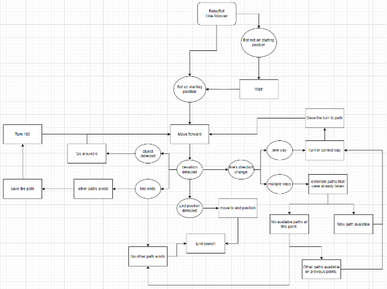

# Line Follower

Line Follower is one of the specialized robots for RelayBot project. The code that controls this robot is written in C++ programming language for Arduino Nano, using PlatformIO in Visual Studio Code.

## Table of Contents
- Requirements
- Installation
- Configuration
- How It Works

## Requirements
- [Visual Studio Code](https://code.visualstudio.com/download)
- [PlatformIO](https://platformio.org/install/ide?install=vscode)
- Arduino Nano AT MEGA 328 
- Integral Neopixle LED’s 
- Rotation Sensors (LM393 Opto-Interrupter) 
- InfraRed Line Sensors 
- Sonar Sensor (HCSR04) 
- 2 Motors 
- Bread-Board
- PCB “Back-Bone” 
- Servo Motor with Integral “Gripper” 
- Bluetooth Wireless Serial Module 
- Power Bank 
- USB Cable 
- H bridge Motor Driver 
- 3 Onboard Push-Buttons 
- 2 Switches 
- Red, Yellow, Green LED’s
- Robot04 Chasis 

## Installation
- Download Zip file from Github
- Open the folder in Visual Studio Code

## Configuration
- Turn the switches on Arduino Nano off
- Connect Arduino Nano to PC using USB cable
- Verify the port is correctly chosen
- Compile and upload the code
- Reset Arduino Nano

## How It Works
The main system contains an IR sensor, which is used for detecting and following the line. The robot waits until it is placed on starting position. Then it moves forward until a deviation is detected. There are four possibilities here.
- If the end position is detected, the robot moves to end position, and the search ends.
- If the line's direction changes, and there is only one way, the robot turns in correct way, saves the turn to path, moves forward, and checks for another deviation. If there are multiple ways, the robot eliminates paths that were already taken. If a new path is available at this point, the rest is the same as one way. If there are no available paths, the robot checks if there are other paths available on previous points, and the rest is the same as one way. If no other path exists, the search ends.
- If the line ends and other paths exist, the robot saves the path, turns 180 degrees, moves forward, and checks for another deviation.
- If an object is detected, the robot goes around the object, moves forward, and checks for another deviation.

